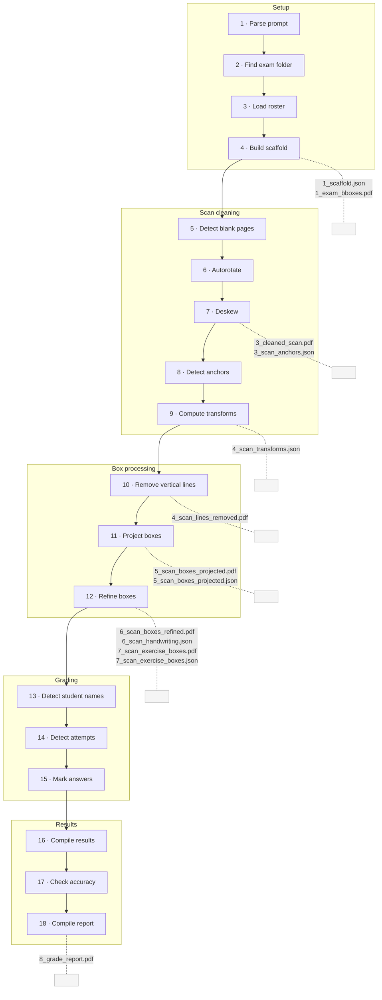

# xScore

Grade scanned exams using AI. Clean PDFs, extract handwritten answers, and produce per-student reports — all from the command line.

---

## Quick start

```bash
python3 -m venv .venv && source .venv/bin/activate
pip install -r requirements.txt
```

Create a `.env` file in the project root:

```
GOOGLE_API_KEY=...     # for Gemini
KIMI_API_KEY=...       # for Kimi (required by xscore.py)
```

Install system dependencies:

| Platform | Command |
|----------|---------|
| macOS | `brew install poppler tesseract` |
| Debian/Ubuntu | `sudo apt install poppler-utils tesseract-ocr` |
| PDF reports (optional) | `brew install --cask mactex-no-gui` |

**Optional — PaddleOCR and EasyOCR (experimental)**  
`bash scripts/install_paddleocr.sh` then `source paddle_env/bin/activate`.  
Not required for normal `xscore.py` use. Installs large ML dependencies (Paddle + PyTorch and models). If `easyocr` fails to install PyTorch, see [PyTorch install](https://pytorch.org/get-started/locally/) for a CPU wheel, then run `pip install easyocr` again inside `paddle_env`.

**Optional — OCR name benchmark (dev / comparison)**  
From the repo root (so `output/<exam>/…` resolves). Either use **`.venv`** after `pip install -r requirements.txt`, or **`paddle_env`** for EasyOCR/Paddle. For `paddle_env`, run **`bash scripts/install_paddleocr.sh`** (includes benchmark deps), or if the venv already exists without them: **`bash scripts/install_paddle_benchmark_deps.sh`**.

`python3 scripts/ocr_name_benchmark.py --folder "path/to/exam"`

Uses the **newest** `3_cleaned_scan.pdf` under `output/<exam_stem>/` unless you pass `--pdf`. Compares Tesseract, EasyOCR, and PaddleOCR on a fixed name strip vs `StudentList.xlsx` (not the same crop as production Kimi name assignment).

---

## Which tool do I need?

| Goal | Tool |
|------|------|
| Grade a full exam folder from a plain-English prompt (includes scan clean + deskew) | `xscore.py` |

The `extraction/` package (profiles, providers, reporting) remains available for custom scripts or tooling you add locally (`from extraction import …`).

Scan rotation, blank-page removal, and fine deskew live in `preprocessing/remove_blanks_autorotate.py` and `preprocessing/deskew.py`, orchestrated by `preprocessing/start_scan.py` when you run `xscore.py`.

---

### Fine deskew (`preprocessing/start_scan.py`)

These A3-portrait scans contain two A4 exam sheets per page (top half and bottom half). The scanner introduces slightly different sub-degree skew in each half. The deskew pass:

1. **Splits** each page at the vertical midpoint into top and bottom halves.
2. **Detects** the rotation angle per half using vertical-projection variance on the full-resolution grayscale half — printed vertical ruling lines produce sharp column-sum peaks when aligned.
3. **Applies** the correction once per half at full resolution (`INTER_CUBIC`, white fill).
4. **Reassembles** the halves and embeds all pages into a rasterised output PDF.

> **Note:** Fine deskew rasterises the output at the chosen `--dpi`. The result is a bitmap-only PDF (pages are not selectable as vector text), which is acceptable for downstream OCR / AI grading.

The toolchain **never overwrites the original scan PDF**: `remove_blanks_autorotate.process_pdf` refuses identical input/output paths, and deskew writes via a temp file before replacing `3_cleaned_scan.pdf` under the run directory.

`preprocessing/start_scan.py` runs fine deskew automatically (pass 3) when called from `xscore.py`. Pass `deskew=False` to disable.

---

## `xscore.py` — grade an exam from a prompt

Point it at an exam folder containing the papers, answer key, class scan, and a `StudentList.xlsx`. Then describe what to grade in plain English.

```bash
python3 xscore.py "check all multiple choice question answers"
python3 xscore.py "count marks for each student" --folder "Space Physics Unit Test"
python3 xscore.py "check the first 5 students' answers" --dpi 300
```

After `source .venv/bin/activate`, use **`python3`** if your shell says `command not found: python` (common on macOS). You can always run **`.venv/bin/python3 xscore.py …`** without activating.

| Option | Description |
|--------|-------------|
| `--folder PATH` | Path to the exam folder |
| `--dpi N` | Override image DPI |
| `--skip-clean-scan` | Skip class-scan prep; use `3_cleaned_scan.pdf` in the current run folder under `output/<exam_stem>/<run_id>/`, a legacy cleaned scan in the exam folder, or a `*scan*.pdf` there |
| `--force-clean-scan` | Ignore `3_cleaned_scan.pdf` cache and run full clean + deskew again (not combinable with `--skip-clean-scan`) |
| `--rescaffold` | Delete scaffold cache before building (force re-parse) |
| `--through-step N` | Exit after pipeline step `N` (1–18); see table below |
| `--no-report` | Print results to terminal only; skip LaTeX/PDF |

The same options (except `--version`) can be implied by the **natural-language prompt**: Kimi returns JSON with fields such as `folder_path`, `skip_clean_scan`, `through_step`, etc. **CLI flags combine with OR** for booleans (`--skip-clean-scan` or prompt says “skip cleaning”). **`--folder`** and **`--dpi`** and **`--through-step`** override the prompt when you pass them.

Each `xscore.py` run writes under `output/<exam_stem>/<run_id>/` (timestamp-based; numeric suffix if needed). Reports and `3_cleaned_scan.pdf` live in that same folder (not configurable).

Results are printed to the terminal. A PDF report is generated by default (requires XeLaTeX). If a ground-truth file is present in the exam folder, accuracy is shown automatically.

> **Note:** `xscore.py` requires `KIMI_API_KEY`.

<a id="pipeline-steps"></a>

### Pipeline steps

When you run `xscore.py`, it executes these steps in order:

| Step | Function | Module |
|------|----------|--------|
| 1. Parse prompt | Converts plain English into a structured task (type, students, DPI, folder hint/path, scan/scaffold/report flags, optional `through_step`) | `marking/parse_instruction.py` |
| 2. Find exam folder | Resolves the exam folder from `--folder`, then prompt `folder_path`, then hint / heuristic | `marking/find_exam_folder.py` |
| 3. Load roster | Reads student names from `StudentList.xlsx` in the exam folder | `shared/load_student_list.py` |
| 4. Build scaffold | Parses the exam PDF and answer key to produce a question tree with marks, bounding boxes, and correct answers (cached under the run directory) | `scaffold/generate_scaffold.py` |
| 5. Detect blank pages | 72 DPI pass; writes `2_scan_blanks.json` under the run directory | `preprocessing/start_scan.py` |
| 6. Autorotate | Drops blanks, applies PDF `/Rotate` or Tesseract OSD; writes `2_scan_rotated.pdf` | `preprocessing/remove_blanks_autorotate.py` |
| 7. Small angle correction | Per-half deskew; writes `3_cleaned_scan.pdf` and `3_scan_anchors.json` (IGCSE anchor slots are filled in step 8) | `preprocessing/deskew.py` |
| 8. Detect page anchors | Template-matches IGCSE headers into the sidecar; skipped with `--skip-clean-scan` | `preprocessing/deskew.py` |
| 9. Calculate transformation | Writes `4_scan_transforms.json` (4-up ↔ scan similarity per page) when a matching four-up raw exam exists | `scaffold/project_boxes_on_scanned_exam.py` |
| 10. Remove vertical lines | Rasterises the cleaned scan and erases all 6 printed vertical ruling lines per page (left margin, centre, and right margin on both the top and bottom halves of each 4-up scan page) using OpenCV morphological line detection. Writes `4_scan_lines_removed.pdf`, which all later steps use as their scan input | `scaffold/detect_handwriting.py` |
| 11. Project bounding boxes | Debug PDF `5_scan_boxes_projected.pdf` and `5_scan_boxes_projected.json` (exercise, eq-blank, and yellow rects per page) from transforms; skipped with `--skip-clean-scan` | `scaffold/project_boxes_on_scanned_exam.py` |
| 12. Refine bounding boxes | Crops yellow margin strips from the line-free scan and checks each one for handwriting using classical OpenCV analysis (ink density after morphological line removal). Writes `6_scan_handwriting.json` and `6_scan_boxes_refined.pdf` (green = blank, red = handwriting). If handwriting is found beside an exercise box, the exercise box is expanded to absorb the margin strip; otherwise the margin box is discarded. Saves adjusted boxes to `7_scan_exercise_boxes.json` and `7_scan_exercise_boxes.pdf`. An optional PaddleOCR-based detector (`method="paddle"`) is also available but not used by default | `scaffold/detect_handwriting.py` |
| 13. Detect student names | Kimi vision on each page; maps pages to roster entries | `marking/assign_pages_to_students.py` |
| 14. Detect questions attempted | One Kimi call per page for attempted question numbers; used in step 15 to skip unanswered questions | `marking/detect_answered_questions.py` |
| 15. Mark answers | Grades only attempted questions (`check_mc` / `check_answers` / `count_marks`; count_marks ignores step 13 filter) | `marking/grade_answers.py` |
| 16. Compile results | Prints page assignments, marks table, and summaries in the terminal | `reports/print_results.py` |
| 17. Check accuracy | If a ground-truth file exists, compares and prints per-student accuracy | `shared/load_ground_truth.py` |
| 18. Compile report | LaTeX/PDF report; skipped with `--no-report` | `reports/generate_report.py` |



---

### How the exam scaffold is built (step 4)

The scaffold is the structured model of the exam: question numbers, stems, answer options, geometry, embedded figures, and correct answers. **No AI is used** — only **PyMuPDF** on vector PDFs, following Cambridge-style left-margin question numbering.

**Exam folder contents required:**
- A **raw exam PDF** — filename containing `raw` or `exam`, but not `answer` or `scan`
- An **answer key PDF** (optional) — filename containing `answer`

**How it works (`scaffold/generate_scaffold.py` + `scaffold/pdf_parser/`):**

1. **Exam PDF** — Detect question numbers from left-margin text (`get_text("dict")`, font-size band). Compute vertical regions per question; extract exact stem text; detect rectangles and ruled lines as writing areas; rasterise embedded figures to `scaffold_images/` under the run directory. Sub-questions (`9a`, `9b`, `11ci`, `11cii`, …) are split from Cambridge-style `(a)` / `(i)` / `(ii)` patterns.
2. **Answer key PDF** — Parsed as text only; two sources of answers are merged:
   - **Table rows** `11(a)`, `11(b)`, `11(c)(i)`, `11(c)(ii)` → matched to scaffold ids `11a`, `11b`, `11ci`, `11cii`; model answer text goes to `correct_answer`
   - **Printed MC lines** `Question 38 (Answer: A)` → letters assigned to matching MC leaves in document order
3. **Bounding boxes** — Each leaf's `bbox.y0` is pulled down to just below the last text line of the preceding exercise in the same layout cell, so regions don't overlap.
4. **Cache** — `1_scaffold.json` in the run directory (sparse JSON: fields are omitted when null or empty), plus `scaffold.md` with the same content in a readable layout. Reloaded when no source PDF is newer than the cache; rebuilt and re-cached automatically otherwise. Older `scaffold_cache.json` files (flat in the run folder, under `scaffolds/`, or next to the exam inputs) are still loaded until replaced on the next save.

**`build_scaffold(folder, client=None, artifact_dir=...)`** — `client` is unused (backward compatibility). `xscore.py` passes a per-run `artifact_dir`; the default helper is `exam_artifact_dir()` for other callers.

**`Question` fields written to `1_scaffold.json`:**

| Field | Role |
|-------|------|
| `number` | Hierarchical label: `"9"`, `"9a"`, `"9ai"`, `"38_2"` (duplicate in column) |
| `question_type` | `multiple_choice` / `short_answer` / `calculation` / `long_answer` |
| `text` | Stem text (MC: stem only; options in `answer_options`) |
| `marks` | Parsed from `[N marks]` / `[N]` |
| `bbox` | PDF points + 1-based page number |
| `answer_options` | MC options list `{letter, text}` (omitted for non-MC) |
| `correct_answer` | Model answer from the answer key (omitted if unknown) |
| `marking_criteria` | Additional marking guidance (omitted if none) |
| `images` | Embedded exam figures (omitted if none) |
| `writing_areas` | Detected answer boxes/lines (omitted if none) |
| `subquestions` | Nested sub-parts (omitted for leaves) |

---

## Configuration

All tunables live in `config.py`: AI model, DPI, crop fractions, API retry settings, and more.

| Setting | Purpose |
|---------|---------|
| `AI_MODEL` | Default model hint for `extraction/` providers (`gemini-*` or `kimi-*`) |
| `PIPELINE_AI_MODEL` | Model for `xscore.py` |
| `PDF_DPI` | DPI for image conversion |
| `EXAM_PROFILE` | Layout profile when using `extraction/` programmatically |

---

## Ground truth

`xscore.py` evaluates against a ground-truth file in the exam folder when present (`shared/load_ground_truth.py`). The `extraction/ground_truth.py` helpers target `GROUND_TRUTH_PATH` in `config.py` if you build your own tooling on top of `extraction/`.

---

## Project layout

[`xscore.py`](xscore.py) orchestrates the flow (mostly via late imports in `_run`). Packages live at the repo root:

```
xscore.py            Prompt-driven grading CLI
config.py            Models, DPI, paths, and all tunables
extraction/          Profiles, AI providers, reporting (library)
preprocessing/       start_scan, remove_blanks_autorotate, deskew, draw_scaffold_bounding_boxes
scaffold/            generate_scaffold, draw_boxes_on_empty_exam, project_boxes_on_scanned_exam, pdf_parser/
marking/             parse_instruction, find_exam_folder, assign_pages_to_students, …
reports/             print_results, generate_report
shared/              models, exam_paths, terminal_ui, load_student_list, load_ground_truth
```

### Package roles

| Folder | Role |
|--------|------|
| [`extraction/`](extraction/) | AI vision extraction: profiles, providers (Gemini/Kimi), reporting helpers. |
| [`preprocessing/`](preprocessing/) | Raw class scan → `3_cleaned_scan.pdf` (blank removal, autorotate, deskew, optional debug PDFs). |
| [`scaffold/`](scaffold/) | Vector exam + answer key → `ExamScaffold`, cache, figure PNGs, boxes on empty exam, geometry onto scans. |
| [`marking/`](marking/) | Kimi-driven steps: parse instruction, find folder, assign pages, detect attempted questions, grade. |
| [`reports/`](reports/) | Terminal tables / summaries and LaTeX → PDF report. |
| [`shared/`](shared/) | Dataclasses, path helpers, CLI formatting, roster and ground-truth I/O. |

### Terminal output

[`shared/terminal_ui.py`](shared/terminal_ui.py) formats `xscore.py` progress with compact step headers (single line). Set **`PIPELINE_DEBUG_AI=1`** to log truncated model responses (first 500 characters) to stderr via the `autograder.ai` logger for marking and extraction Kimi calls.

### Import reference (steps 1–18)

Same order as [Pipeline steps](#pipeline-steps); paths are Python packages (run from repo root).

| Step | Module | Notes |
|------|--------|-------|
| 1 | `marking.parse_instruction` | `parse_prompt(...)` |
| 2 | `marking.find_exam_folder` | `find_folder(...)` |
| 3 | `shared.load_student_list` | `read_student_list(...)` |
| 4 | `scaffold.generate_scaffold` | `build_scaffold(...)` |
| 5–9 | `preprocessing.start_scan` | `detect_blank_pages_phase`, `autorotate_phase`, `deskew_phase`, `detect_page_anchors_phase`, `compute_transformation_phase`; or `cleanup_pdf(...)` |
| 10 | `scaffold.detect_handwriting` + `preprocessing.start_scan` | `remove_vertical_lines_phase(...)` |
| 11 | `preprocessing.start_scan` | `project_bounding_boxes_phase(...)` |
| 12 | `preprocessing.start_scan` + `scaffold.detect_handwriting` | `refine_bounding_boxes_phase(...)` |
| 13 | `marking.assign_pages_to_students` | `assign_pages(...)` |
| 14 | `marking.detect_answered_questions` | `detect_answered_exercises(...)` |
| 15 | `marking.grade_answers` | `grade_students(...)` |
| 16 | `reports.print_results` | `print_*` helpers |
| 17 | `shared.load_ground_truth` | optional evaluation |
| 18 | `reports.generate_report` | `generate_report(...)` |

### Vector PDF parsing

[`scaffold/pdf_parser/`](scaffold/pdf_parser/) implements layout detection, regions, content extraction, and assembly into `Question` trees. Import the stable surface from `scaffold.pdf_parser`.

---

## Security

Do not commit `.env`, the `output/` directory, scans, ground-truth files, or any file containing student data. The `output/` tree is gitignored so it is never pushed to GitHub; do not force-add it.
